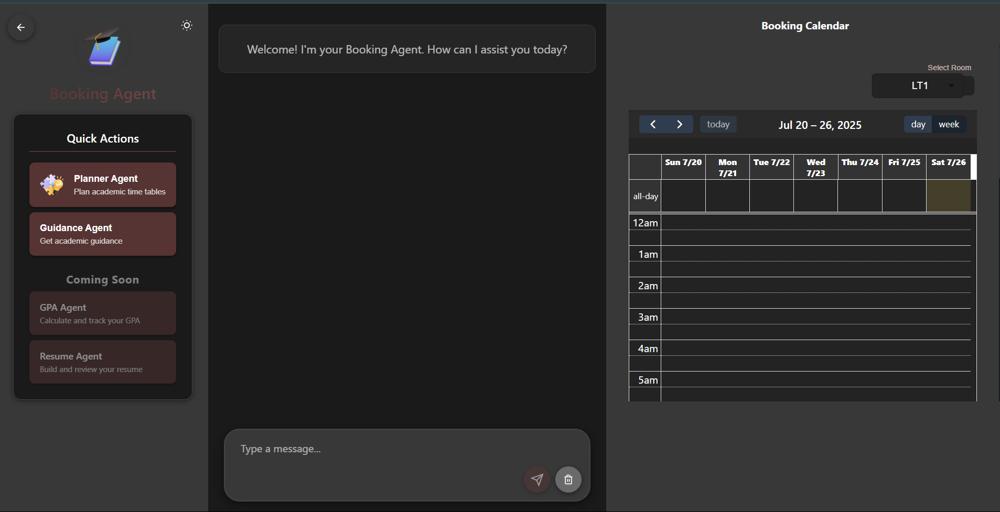
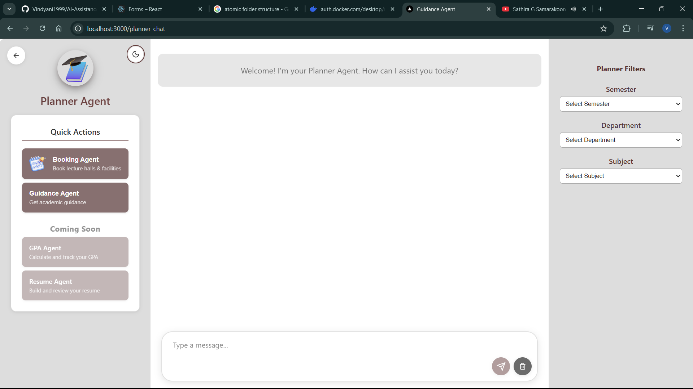

# Agentic AI-Powered Workflow Automation System

An AI assistant platform containing multi-agent system




<!-- Image 5 -->

<br>
</br>
<!-- Image 6 -->

<br>
</br>

<br>
</br>

<!-- Image 2 -->

<br>
</br>


<br>
</br>
<!-- Image 3 -->


## Project Structure

- `backend/` — Python backend (FastAPI)
- `frontend/` — React TypeScript frontend
- `data/` — Databases, documents, vector stores
- `assets/` — Images and static files
- `scripts/` — Utility scripts
- `docs/` — Documentation
- `notebooks/` — Jupyter notebooks

## Completed sections

- [x] Database integration
- [x] Vector database preparation
- [x] Backend setup (FastAPI)
    - [x] Web search tool for Guidance Agent
    - [x] RAG tool for Guidance Agent
    - [x] SQL tool (mini databases) for Guidance Agent
- [x] Frontend setup with React + Typescript
    - [x] Chat interface for GA
    - [x] Landing page 
    - [ ] University email login
    - [ ] User separated chat interfaces
- [x] Agent can select required tool based on user query
- [x] Agent can understand user queries whether they are grammatically wrong
- [x] Agent has chat history
- [x] Rearrange folder structure

## Quick Start

1. **Backend:**
   
   The backend provides a FastAPI REST API interface designed to work with the React frontend:

```bash
python -m venv venv
.\venv\Scripts\activate
pip install -r requirements.txt
python main.py
```
Required environment variables:
- `OPENAI_API_KEY`: Your OpenAI API key
- `TAVILY_API_KEY`: Your Tavily search API key
- `LANGCHAIN_API_KEY`: Your LangChain API key

2. **Frontend (optional):**

```bash
cd frontend
npm install
npm start
```

3. **Prepare vector DB:**
   - `cd backend`
   - `python scripts/prepare_vector_db.py`

## Requirements

- Python 3.9+
- Node.js 16+
- API keys for OpenAI, Tavily, LangChain (see `.env.example`)

## Databases

- Student Handbook Database
- ByLaw Database
- Examination Manual VectorDB
